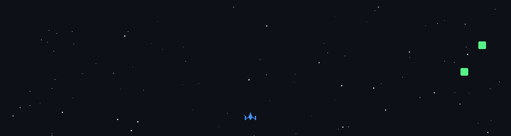

  

  
  

---

### merhaba

Ben **akinbdl**. Arayüz ve design system tarafında çalışıyorum — React ve TypeScript ile tekrar kullanılabilir, ölçeklenebilir bileşenler üretiyorum.

Şu an [**atlas-ui**](https://github.com/akinbdl/atlas-ui) üzerindeyim: Tailwind CSS v4 ile yazılmış, 45+ bileşenli bir React tasarım sistemi.

---

### yığın

  

| alan | araçlar |
| --- | --- |
| Arayüz | React, TypeScript, Tailwind CSS v4 |
| Sistem | Design tokens, component APIs, 45+ UI primitive |
| İş akışı | Git, GitHub, VS Code |

---

### öne çıkan

**[atlas-ui](https://github.com/akinbdl/atlas-ui)** — React design system with Tailwind CSS v4 — 45+ components

  

---

### github

  
  

  <a href="https://github.com/akinbdl">github.com/akinbdl</a>

